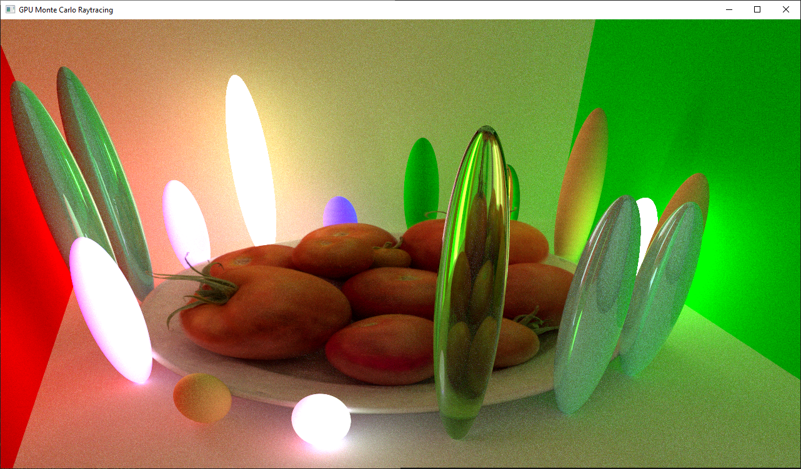
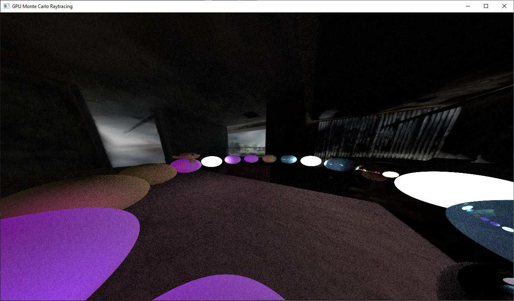
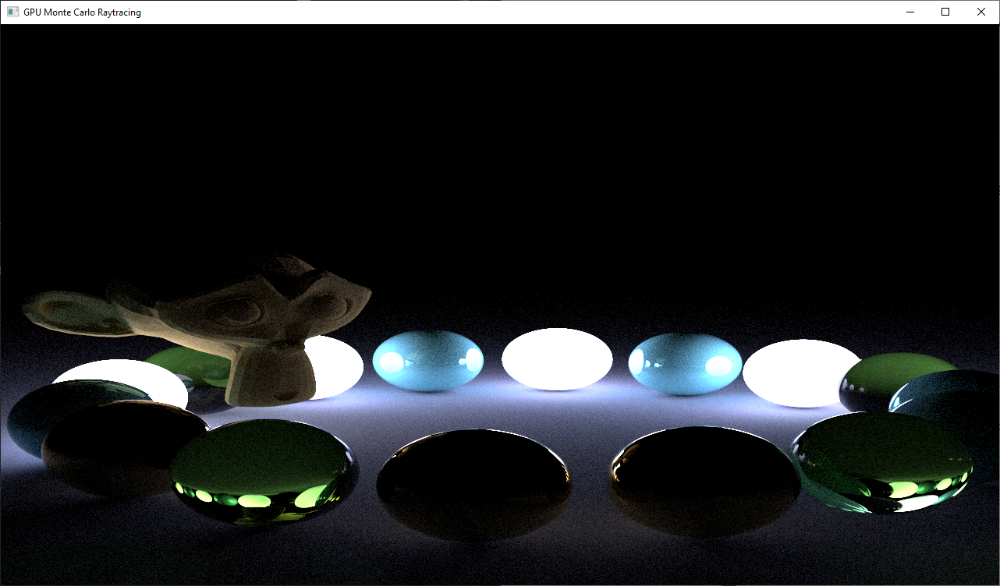
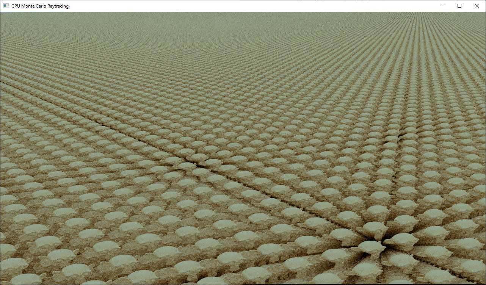

# Offline GPU Path Tracer

Progressive Monte Carlo GPU path tracer written in Slang and C++ using Vulkan.





8 billion instances of Suzanne:


# Project features

- Sphere primitives
- Triangle primitives + OBJ loader
- BSDF mmaterial support for ior and metallic
- CPU BVH construction and GPU traversal
- Mesh lights
- Gaussian Splat primitives + PLY loader
- Progressve path tracing with temporal accumulation
- Transforms (location, rotation, scale)
- Instancing
- TLAS/BLAS separation
- Mixed node types (transform, primitive, binary AABB, 8-wide KDOP)
- Nested instances

# Implementation details

This section does not cover every aspect of the engine. (e.g. Triangle, and Sphere intersections will not be covered)

## Transforms

Transforms are the easiest way to make instances of BLAS. Transforms have a single child that can be any node type (Inner node, Primitive, other transform, etc.).\
Since transforms point to an arbitrary child, it allows for construction of nested instances.

## Nested Instances

The following will use these definitions: \
Primitive: a single triangle, sphere, gaussian splat, etc. \
Instance: a collection of primitives contained in a BLAS. \
Collection: group of instances in an acceleration structure. \
Note: collections can contain other collections. This node structure means the following tree is possible: \

```
root TLAS
├── transform
|       └── pointer to Collection 1
└── transform
        └── pointer to Collection 1

Collection 1 TLAS
        ├── pointer to Instance BLAS
        └── transform 
                └── pointer to Instance BLAS
```

Using this structure, an arbitrarily large number of primitives can be represented on a smaller footprint while also having a small build time.

For example: a N by N by N cube of Suzannes would contain N^3 Suzanne instances in a non-nested TLAS, but a nested TLAS can represent the same scene by repeating instances of collections of Suzannes. \
This lowers the memory footprint and build time for scenes with repeated groups of instances, \
allowing for much larger scenes in the same memory footprint and build-time constraints.

## Gaussian Splat primitives

The PLY loader is adapted from [3D Gaussian Splatting in a Weekend](https://bfeldman.me/3dgs-weekend/).

Collisions with gaussian splat primitives are calculated using their covariance matrix and center. \
The path tracer takes advantage of its Monte Carlo architecture to stochastically hit/miss splat primitives. \
By averaging samples across many rays, the path tracer simulates alpha blending of many splats.

Read more about this type of gaussian splat ray tracing here: [Stochastic Ray Tracing of Transparent 3D Gaussians](https://arxiv.org/pdf/2504.06598)

# References:

This is an incomplete list of references used when making this project.

Sun, Xin, et al. "Stochastic Ray Tracing of Transparent 3D Gaussians." arXiv preprint arXiv:2504.06598 (2025). \
Feldman, Benjamin. (May 2026). “3D Gaussian Splatting in a Weekend”. bfeldman.me. https://bfeldman.me/3dgs-weekend/. \
Arman Uguray. "Ray Tracing: GPU Edition". https://raytracing.github.io/gpu-tracing/book/RayTracingGPUEdition.html. \
Vaidyanathan, Karthik, Sven Woop, and Carsten Benthin. "Wide BVH traversal with a short stack." Proceedings of the Conference on High-Performance Graphics. 2019. \
